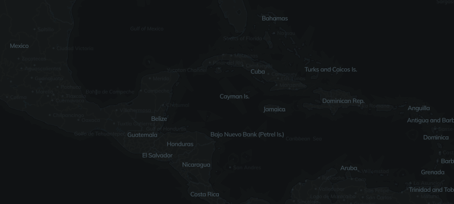
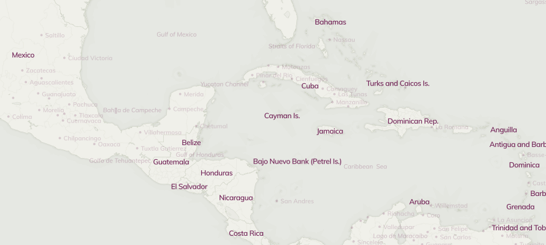
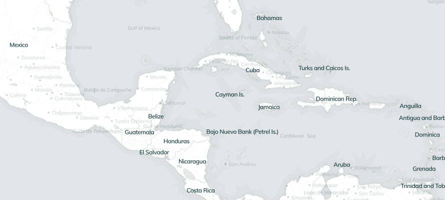

# basemap-server

> Batteries-included visualization basemap server using [Natural Earth Data](http://www.naturalearthdata.com), [TileStache](http://tilestache.org) and [Mapnik](http://mapnik.org).


## Usage

### Docker

```bash
docker build -t basemap-server .

docker run -p 8000:80 -it basemap-server

open index.html
```


## Themes

### `/grey/{z}/{x}/{y}.png`




### `/sepia/{z}/{x}/{y}.png`




### `/silver/{z}/{x}/{y}.png`




## Extending

> **Note:** The following instructions assume you're using [TileMill](http://tilemill-project.github.io/tilemill/) and exporting projects as Mapnik XMLs.

### Adding Shapefiles

Add new shapefiles to [shapefiles](/shapefiles), then add to TileMill as a layer.


### Adding Fonts

Add new fonts to [fonts](/fonts), then make them available to TileMill however you normally install fonts on your system.


### Adding Mapnik XMLs

After exporting a Mapnik XML from TileMill into the `themes` folder, from the terminal execute:

```bash
./scripts/normalize
```
